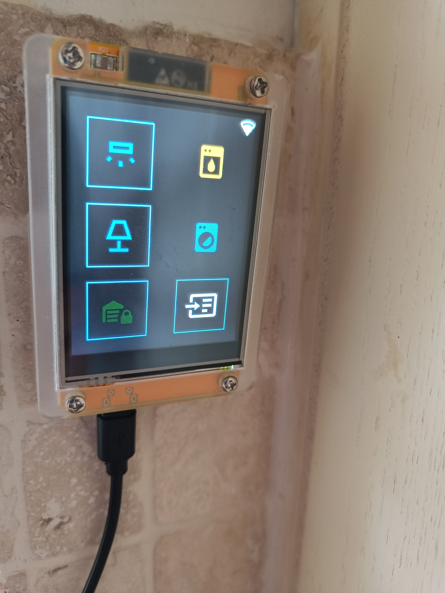
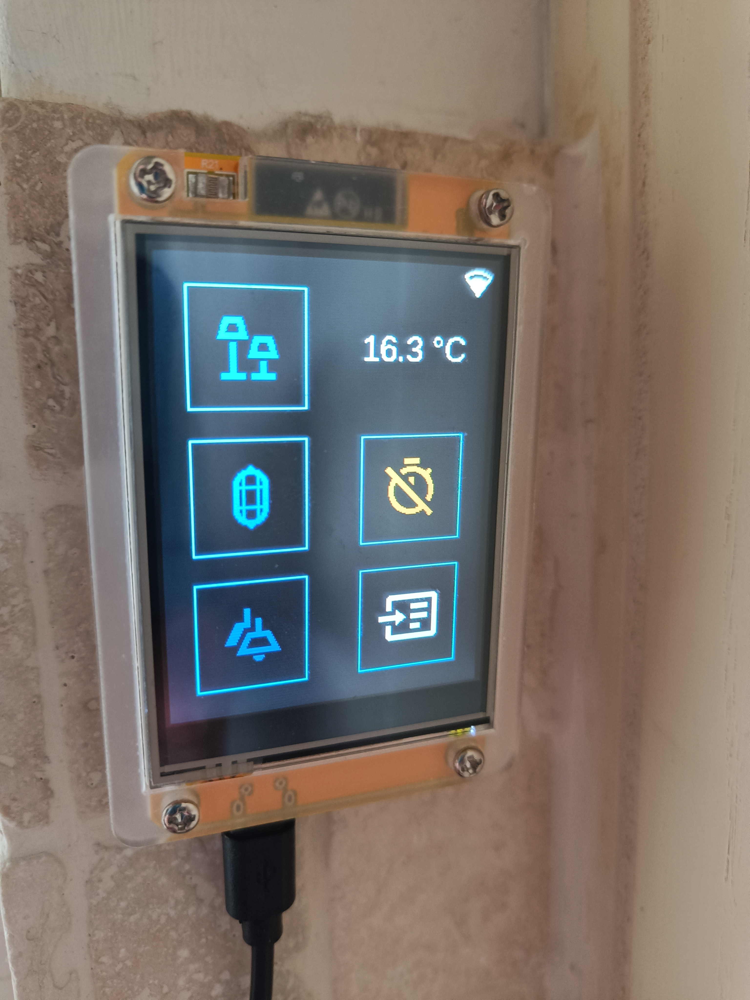
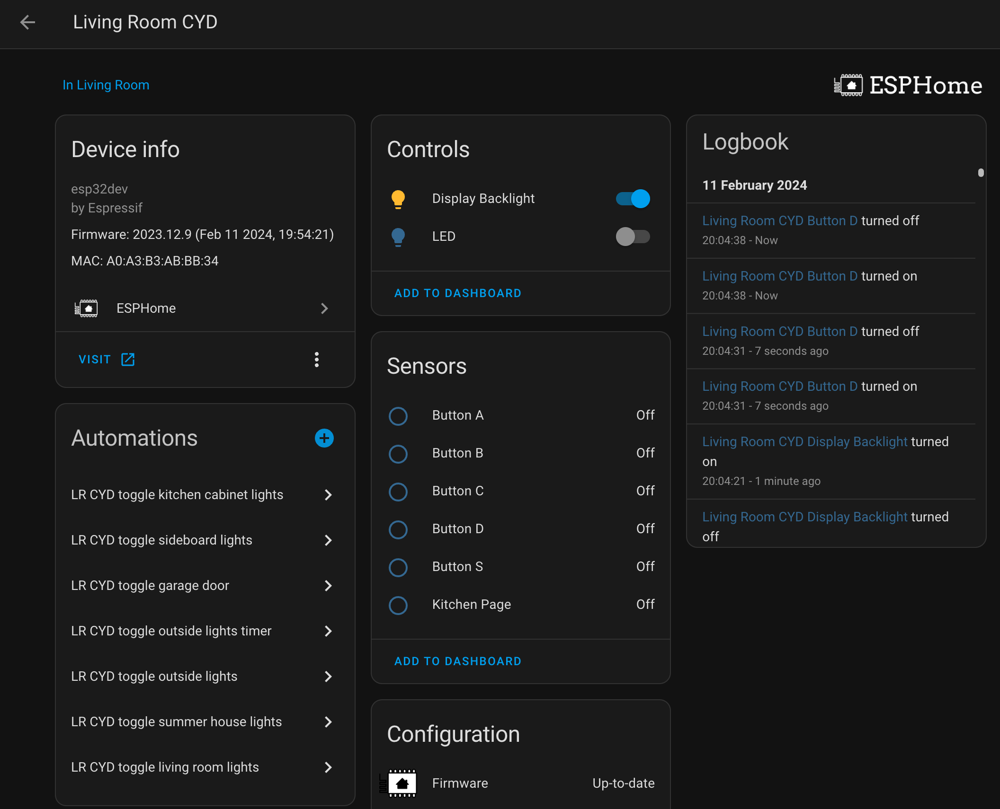
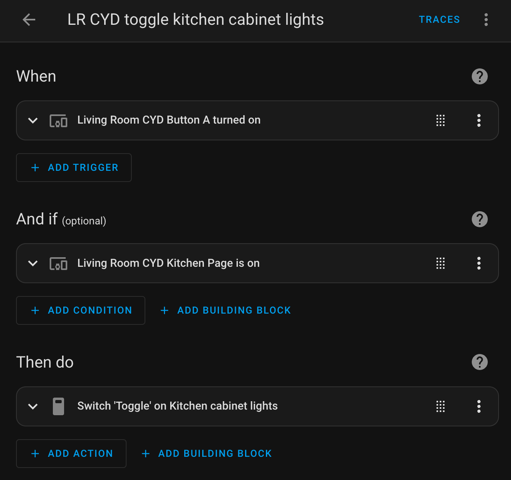

# ESPHome CYD Lightswitch for Home Assistant

I used the examples [here](https://github.com/witnessmenow/ESP32-Cheap-Yellow-Display/tree/main/Examples/ESPHome) as a starting point to get two CYD (aka ESP32-2432S028R) displays to work in ESPHome.

I have 2 pages (one for each room) so that all functions are accessible from either room, but the start page corresponds to whichever room the device is set up for.

No need to rotate the displays as their locations don't have space for them to be any other orientation.

## My setup:

### Page 1

#### Kitchen

- Kitchen cabinet LED lights controlled by Sonoff Basic R2 switches running tasmota grouped into one virtual switch
- Dining room sidelights controlled by a Gosund plug converted to tasmota
- Dishwasher monitored by a Gosund plug converted to tasmota
- Washing machine monitored by a Gosund plug converted to tasmota

#### Garage

- Electric door "locked" via a Gosund plug connected via Tuya integration (refuses to be converted to tasmota)

### Page 2

#### Living Room

- Sidelights controlled by Sonoff Basic R2 switches running tasmota
- Door sensor connected via Tuya integration

#### Summer House

- Double lightswitch connected via Tuya integration:
  - Switch 1: interior lights
  - Switch 2: garden lights
- Thermometer connected via Tuya integration

#### Garden Lights Automation

The door sensor triggers the garden lights and starts a 5 minute countdown timer to switch off the lights.  The timer's action can be disabled via a boolean sensor.

***

### Setup

In order for the yaml to work the following settings needed to be added to the secrets.yaml file:
 - kit_api_key
 - lroom_api_key
 - ota_password
 - wifi_ssid
 - wifi_password
 - ap_password

For some of the examples you need to copy font or image files to your ESPHome folder. Those examples contain the instructions in the yaml file itself.

### Home Assistant

Buttons A-C are on the left; D and S (switch page) are on the right.  The kitchen page does not use button D.

In automation, ensure that expected page is being viewed

***

#### TODO

- There must be a way to move the interval section so that the start page can be specified programatically
- Need to stop the switch from activating unless the backlight is on
  - this is tricky as the backlight gets switched on by touching the screen...
